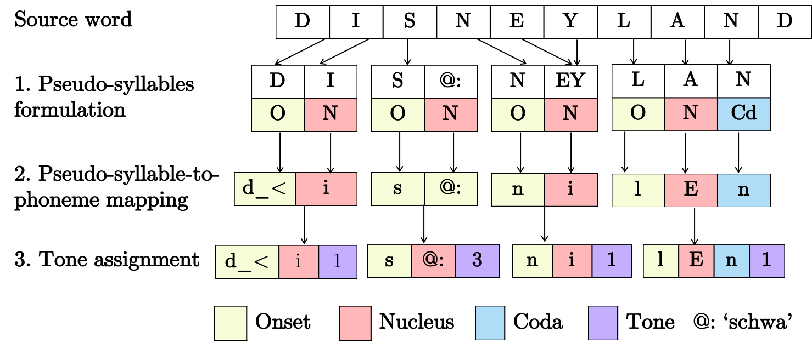
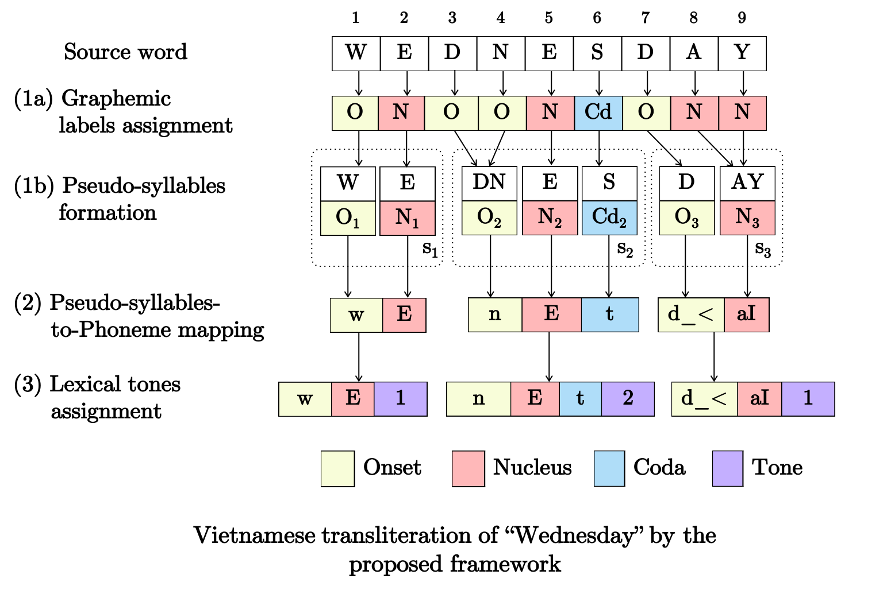
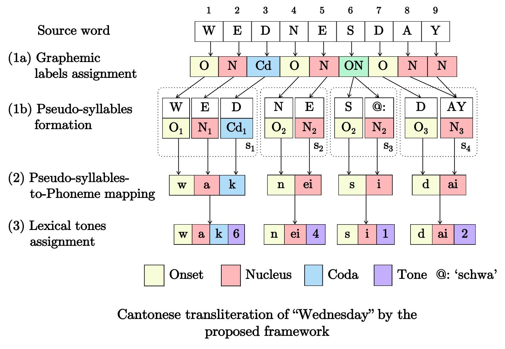

# PHONOLOGY-AUGMENTED TRANSLITERATION FOR LOW-RESOURCED LANGUAGES

## Data format

- Training: each line in the input file for training has one word in lower-cased Latin alphabets and a transliteration output, with the syllables of each word delimited by . (a dot).
- Testing: each line in input file for testing has one word in lower-cased Latin alphabets


## How to run
Since pronunciation of the source language is used in the back-off model, [CMU pronunciation dictionary](http://www.speech.cs.cmu.edu/cgi-bin/cmudict) needs to be installed.

Command:
```
python transliterator.py TRAIN_FILE TEST_FILE OUTPUT_FILE INTERMEDIATE_OUTPUT_DIR CMU_DECODER LOG_FILE
```
Example:
```
python transliterator.py sample_data/train.lex sample_data/test.lex sample_data/test.output sample_data/tmp ~/cmu_decoder/t2p_dt.pl sample_data/tmp/log.txt
```

# How it works

**Reference**:

- Gia H. Ngo, Minh Nguyen, Nancy F. Chen (2018). Phonology-Augmented Statistical Framework for Machine Transliteration using Limited Linguistic Resources

The proposed model performs translieration in three steps, as summarized in Figure 3 of Ngo et al., 2018 and reproduced below:



**1. Pseudo-syllable formulation**: graphemes of the source word are organized into pseudo-syllables. Source graphemes are assigned explicitly to the sub-syllabic units of each pseudo-syllable such that the units form valid syllabic structures defined by the target language’s phonology.

**2. Pseudo-syllable-to-phonememapping:** a languagemodel is used to map the graphemes of each pseudo-syllable, given their assigned unit in a syllable, to the most likely phonemes.

**3. Tone assignment:** one tone is assigned to each syllable, based on the target language’s phonemes in each syllable.

----

*Q: How does the framework handle irregular grapheme to phoneme relationships in a language?*

In the pseudo-syllable formulation step, the model learns from the training data how the letters of the source word would be reorganized to the target word’s syllables.

Using `WEDNESDAY` as an example, we would demonstrate how the proposed framework produces its transliteration in Vietnamese and Cantonese.

One transliterated output of `WEDNESDAY` in Vietnamese (represented by X-SAMPA symbols) by the model is `w E 1 . n_< E t 2 . d_< aI 1`. The following figure shows the three steps for transliterating `WEDNESDAY` to Vietnamese:



Referring to the figure above, the silenced `D` at position 3 in the word `WEDNESDAY` was handled by being "merged" with the adjacent `N`  at position 4 (as both were assigned the graphemic label `O` for onset in step 1a) to form the onset of the second pseudo-syllable (O2 in step 1b).

One transliterated output for `WEDNESDAY` in Cantonese (represented Jyutping symbols) by the model is `w a k 6 . n ei 4 . s i 1 . d ai 2`. The following figure shows the three steps of transliterating `WEDNESDAY` to Cantonese:



Referring to the figure above, the `D` at position 3 in the word `WEDNESDAY` was assigned the graphemic label `C` in step 1a and thus assigned to the coda sub-syllabic unit of the first pseudo-syllable in step 1b. The `S` at position 6 was assigned the label `ON` in step 1a and thus has a schwa inserted, which together form the third pseudo-syllable in step (1b).
